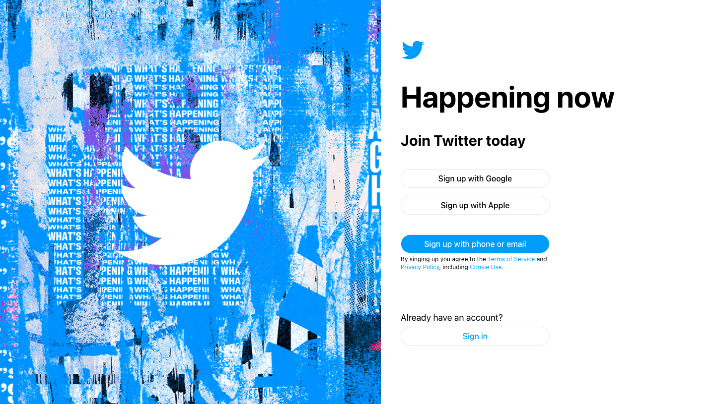
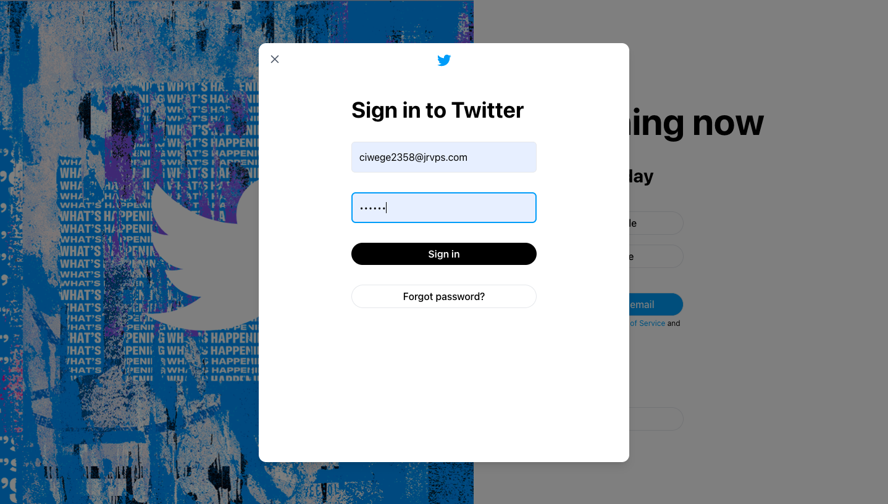
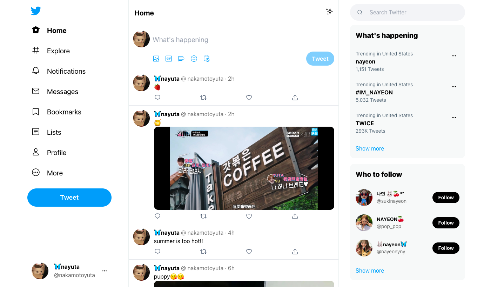
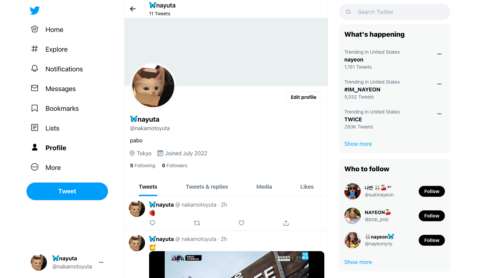
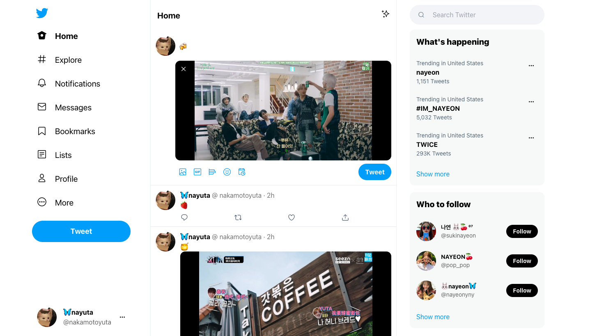

# Preview ✨

## Landing

## Login

## Home

## Profile

## Publisher

## Timeline

## Resize

# Vercel ✨
You can visit vercel link [here](https://twitter-like-jet.vercel.app) with the following email and password

|  |  |
| ------ | ------ |
| email | ciwege2358@jrvps.com |
| ------ | ------ |
| password | nayuta |

# Features ✨

> NOTE: Just implement main features of Twitter

- Database with [Supabase](https://github.com/supabase)
- Hot Module Replacement with [Vite](https://vitejs.dev/)
- CSS framework with [TailwindCSS](http://tailwindcs.com/)
- Next generation state management for Vue with [Pinia](https://pinia.vuejs.org/)
- Authentication using email and magic link provided by Supabase
- One email one account
- List Tweets feed by timeline
- Publish Tweets with images
- Upload images to Supabase Buckets
- Like Tweets
- Retweets
- Reply to Tweets
- See following and see their followers
- See Liked Tweets List
- See Retweets Tweets List
- See Tweets List with Media

# Tech ✨

- [Supabase](https://github.com/supabase)
- [PostgreSQL](https://www.postgresql.org/)
- [Vue](https://v3.vuejs.org/)
- [Vite](https://vitejs.dev/)
- [Pinia](https://pinia.vuejs.org/)
- [Vue Router 4](https://next.router.vuejs.org)
- [TailwindCSS](http://tailwindcs.com/)

# Improvements ✨

- [ ] Switch night & light mode
- [ ] Like effect
- [ ] Multiple Images Tweets
- [ ] Follow users 
- [ ] Modify profile
- [ ] Notifications
- [ ] Trending

# Disclaimer ✨

Twitter-like is just created for educational purposes only.